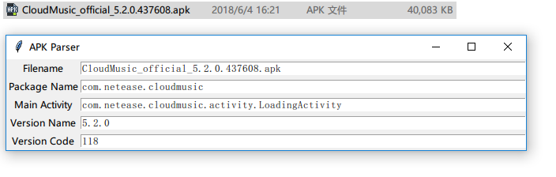

# apkutils [](https://badge.fury.io/py/apkutils) [](https://github.com/mikusjelly/apkutils/blob/master/LICENSE)


A library that gets infos from APK.

### Install and Test

```
$ pip install apkutils
```

Or

```
$ pip install git+https://github.com/codeskyblue/apkutils
```

### Usage

```
$ python3 -m apkutils -h
usage: apkutils [-h] [-m] [-s] [-f] [-c] [-V] p

positional arguments:
  p              path

optional arguments:
  -h, --help     show this help message and exit
  -m             Show manifest
  -s             Show strings
  -f             Show files
  -c             Show certs
  -V, --version  show program's version number and exit

GUI tool

```
$ python -m apkutils.gui
# Click Bind
```

Right click an `*.apk` file. Select `APK Parser`. You will see



### Reference
- apkutils\axml from [mikusjelly/axmlparser](https://github.com/mikusjelly/axmlparser) 
- apkutils\dex from [google/enjarify](https://github.com/google/enjarify)

## Genreate README.rst
README.rst auto generated by `m2r --overwrite ./README.md`. Get m2r tool through `pip install m2r`